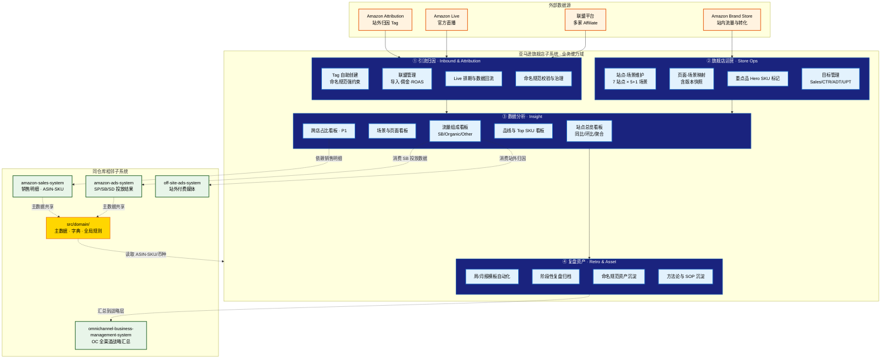

# 亚马逊旗舰店子系统 · L1 业务能力架构 (v0.1)

> **文档日期**：2026-04-22
> **本图回答**：旗舰店业务流程上有哪些能力？分别归口给哪个角色？与哪个外部子系统交换数据？

---

## 一、设计原则（来自 12-23 业务方需求讨论会 与 工作范式 §1.1）

1. **聚焦"引流 → 转化 → 复盘"主航道**：所有能力必须能落到这一主航道的某一段。
2. **L1 不出现菜单粒度**：能力到二级即可；菜单与角色矩阵在 L2 解决。
3. **跨域数据明示边界**：与 amazon-sales / amazon-ads / off-site-ads / OC 的接口在能力图中以"虚线"显式标注。
4. **能力 = 业务方的语言**：直接复用业务方在 `渠道推广角色价值点识别.xlsx` 与 `26 年 ERP 需求对接.xlsx` 中的术语。

---

## 二、能力地图总览（一页速读）

```
┌──────────────────────────────────────────────────────────────────────────────┐
│              亚马逊旗舰店子系统 · 4 大能力域 × 14 项二级能力                    │
├──────────────────────────────────────────────────────────────────────────────┤
│  ① 引流归因          ② 旗舰店运营        ③ 数据分析          ④ 复盘资产       │
│  ----------------    ----------------    ----------------    ----------------│
│  · Tag 自助创建      · 站点-场景维护     · 站点总览看板      · 周/月报模板    │
│  · 联盟管理          · 页面-场景映射     · 场景/页面看板      · 阶段性复盘     │
│  · Live 排期与回流    · 重点品标记        · 流量组成看板      · 命名规范资产    │
│  · 命名规范校验      · 目标管理          · 品线/SKU 看板      · 方法论沉淀     │
│                                          · 跨店占比看板                       │
└──────────────────────────────────────────────────────────────────────────────┘
       ↓                  ↓                     ↓                   ↓
   主用户：CP        主用户：SO            主用户：DA / BO      主用户：CP / BO
```

> **CP** = 渠道推广 · **SO** = 旗舰店运营 · **DA** = 数据分析师 · **BO** = 业务负责人

---

## 三、能力地图（Mermaid 可视化）



> **样式遵循 §10.5 高对比度规范**：组名（深蓝/橙/绿）配反白文字，数据节点（金黄）单独标注。

---

## 四、能力域详解

### ① 引流归因（Inbound & Attribution） — 主用户 **CP**

**业务定位**：把"流量怎么进来 / 怎么追踪 / 怎么算钱"这件事，从 Excel 化人工搬到系统化自动。

| 二级能力 | 价值描述 | 关键支撑 | MVP |
|---|---|---|---|
| **C1.1 Tag 自助创建** | CP 在 ERP 内一站式创建 Amazon Attribution Tag/UTM，按 `品牌-站点-SKU-渠道-日期` 规范自动生成 | 命名校验器 + Attribution API（待评估）| ✅ P0 |
| **C1.2 联盟管理** | 多平台 CSV/Excel 导入 → ASIN→SKU 映射 → 自动算佣金（Sales × 比率）/ ROAS / 预算进度 | 导入器插件化、ASIN-SKU 主数据 | ✅ P0 |
| **C1.3 Live 排期与回流** | 直播档期登记、亚马逊官方直播红人记录、播后数据回流 | 当前手工，P1 接入 SP-API | ⚠️ P1 |
| **C1.4 命名规范校验与治理** | 历史脏 Tag 治理、新建强约束、违规告警 | 命名规范字典（系统资产） | ✅ P0 |

> **关键决策**（来自 12-23 会议）：联盟属于"站外 Other"，Live 属于"站内"，Tag 属于"站外 Other"。这一分类直接决定看板（C3.3）的渠道分桶。

### ② 旗舰店运营（Store Ops） — 主用户 **SO**

**业务定位**：维护"站点 → 场景 → 页面 → SKU"这棵 4 层的业务树，所有看板的下钻路径都依赖它。

| 二级能力 | 价值描述 | 关键支撑 | MVP |
|---|---|---|---|
| **C2.1 站点-场景维护** | 7 站点（北美 2 + 欧洲 5）× 6 场景（公共/居家/户外/观影/新潮/季节）+ 可扩展（活动场景） | 场景类型字典（基础/活动） | ✅ P0 |
| **C2.2 页面-场景映射** | 每个 Brand Store 页面归属唯一场景，新建 / 变更 / 历史快照 | **映射版本快照表**（按月固化） | ✅ P0 |
| **C2.3 重点品 Hero SKU 标记** | SO 手动标记某 SKU 为"重点品"，看板自动汇总 | SKU 维度元数据 | ✅ P0 |
| **C2.4 目标管理** | 月度 / 季度 / 年度目标（Sales 60% + CTR 20% + ADT 15% + UPT 5%）维护与达成跟踪 | 目标表（站点 × 维度 × 周期） | ✅ P0 |

### ③ 数据分析（Insight） — 主用户 **DA / BO**

**业务定位**：替代当前"Excel + DeepSeek 跑代码"的手工流，提供 7 大看板的实时化、统一口径化。

| 二级能力 | 价值描述 | 关键支撑 | MVP |
|---|---|---|---|
| **C3.1 站点总览看板** | 单站点 / 北美聚合 / 欧洲聚合 / 全站聚合；周/月时间维度；环比 + 同比 | 时间筛选器 + 聚合服务 | ✅ P0 |
| **C3.2 场景与页面看板** | 场景维度月度对比、场景下钻到页面、页面下钻到流量组成 | C2.1 / C2.2 映射 | ✅ P0 |
| **C3.3 流量组成看板** | 每个页面拆分 SB / Organic / Other 渠道，含占比与同比 | 渠道分桶规则字典 | ✅ P0 |
| **C3.4 品线与 Top SKU 看板** | 通过 SKU 归类品线（与页面解耦）、Top 20 销额、多 SKU 搜索 | SKU-品线映射 | ✅ P0 |
| **C3.5 跨店占比看板** | 旗舰店 SKU 出单 / 全店 SKU 出单 = 旗舰店占比 | **依赖 amazon-sales-system 销售明细** | ⚠️ P1 |

**统一指标计算服务（贯穿 C3.x）**：

| 指标 | 公式 | 聚合方式 |
|---|---|:---:|
| Sales / Orders / Units / Visitors / Views | sum() | 求和 |
| CVR | Orders / Visitors | **sum/sum 重算**，不可平均 |
| ASP | Sales / Orders | sum/sum 重算 |
| UPT | Units / Orders | sum/sum 重算 |
| NTS 占比 | NTS / Visitors | sum/sum 重算 |
| Daily Views / Daily Sales | Total / 周期天数 | 平均值 |
| ADT | avg(dwell time) | 平均值 |

> **关键决策**：所有比率类指标必须由后端计算服务提供，前端只展示，避免再次出现 Excel 时代的口径漂移。

### ④ 复盘资产（Retro & Asset） — 主用户 **CP / BO**

**业务定位**：把每一次推广复盘的过程、命名规范、方法论，沉淀为组织资产，避免人走资产丢。

| 二级能力 | 价值描述 | 关键支撑 | MVP |
|---|---|---|---|
| **C4.1 周/月报模板自动化** | 看板数据一键生成周/月报 markdown / docx | 报表模板引擎 | ⚠️ P1 |
| **C4.2 阶段性复盘归档** | 大促 / 季度复盘文档归档与检索 | docs/approved/ 落盘 | ⚠️ P1 |
| **C4.3 命名规范资产沉淀** | Tag / 联盟 / 页面命名规范的版本化资产 | 字典表 + 变更日志 | ✅ P0 |
| **C4.4 方法论与 SOP 沉淀** | Attribution 创建 SOP、联盟导入 SOP、看板使用指南 | 子系统 docs/ | ✅ P0 |

---

## 五、能力 ↔ 角色 ↔ MVP 一览矩阵

| 能力域 | 主用户 | 协同角色 | P0 能力数 | P1 能力数 |
|---|:---:|:---:|:---:|:---:|
| ① 引流归因 | CP | SO / DA | 3 | 1 |
| ② 旗舰店运营 | SO | CP / BO | 4 | 0 |
| ③ 数据分析 | DA / BO | CP / SO | 4 | 1 |
| ④ 复盘资产 | CP / BO | DA / SO | 2 | 2 |
| **合计** | — | — | **13** | **4** |

---

## 六、与外部子系统的接口契约（草稿）

| 方向 | 来源 / 去向 | 数据 | 接入方式 | 状态 |
|---|---|---|---|---|
| ⬇️ 入 | `src/domain/data/` | ASIN-SKU 主数据、币种汇率、站点字典 | 直接读取 | 待规整 |
| ⬇️ 入 | `amazon-sales-system` | 全店 SKU 销售明细（用于跨店占比） | 经 domain 共享 | P1 |
| ⬇️ 入 | `amazon-ads-system` | SB 投放结果（用于流量组成 SB 渠道） | 经 domain 或 API | P0 |
| ⬇️ 入 | `off-site-ads-system` | 站外付费媒体归因（与本系统 Tag 互补） | 经 domain | P0 |
| ⬆️ 出 | `omnichannel-business-management-system` | 旗舰店核心指标快照（站点 × 月） | API 或 domain | P1 |

> 所有接口**严禁深层引用**对方源码，必须经 `src/domain/` 交换，符合 `.globalrules` §1。

---

## 七、与下一层（L2 菜单）的对齐预告

L1 的 4 大能力域将在 L2 菜单（`flagship-store_menu_v1.md`）落为以下一级菜单（草稿，下一批交付时定稿）：

```
① 引流归因  → 一级菜单：Tag 中心 / 联盟中心 / 直播中心
② 旗舰店运营 → 一级菜单：站点与场景 / 页面映射 / 重点品 / 目标管理
③ 数据分析  → 一级菜单：旗舰店看板（含 7 大 Tab）
④ 复盘资产  → 一级菜单：复盘与资产
+ 系统设置（命名规范、佣金比例、字段映射、权限）
```

---

## 八、版本记录

| 版本 | 日期 | 变更点 |
|---|---|---|
| v0.1 | 2026-04-22 | 首版：4 大能力域 × 14 项二级能力 + Mermaid 能力地图 + 与外部子系统接口契约草稿 |

---

作者：@beynawoo-code
